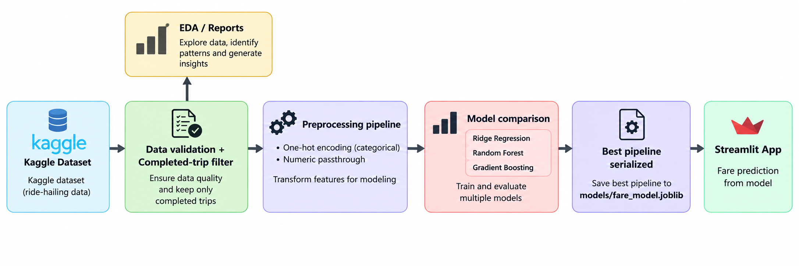
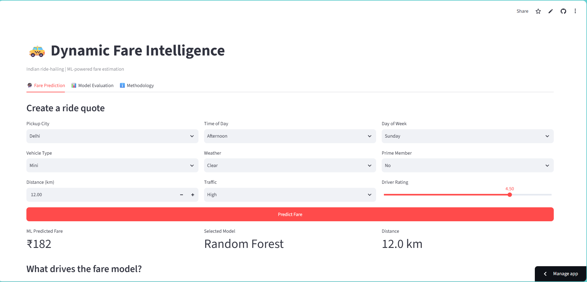

---


[](https://dynamic-fare-intelligence.streamlit.app/)
--- 
An end-to-end machine-learning project for **dynamic fare estimation** using a public synthetic Indian ride-hailing dataset.

> **Important:** The Kaggle dataset used in this project is synthetic.

## Project Highlights

- **Dynamic fare estimation:** predicts a ride fare from trip context, route distance, vehicle type, traffic, and other ride attributes.
- **Model benchmarking:** compares Ridge Regression, Random Forest, and Gradient Boosting.
- **Robust preprocessing:** categorical variables are one-hot encoded inside a single sklearn pipeline.
- **Model selection:** selects the best model using test RMSE, with MAE and R² reported.
- **Interactive Streamlit dashboard:** fare prediction, model evaluation, feature importance, and EDA.
- **Reproducible training script:** all deployment artifacts are generated by `src/train_model.py`.

## Dataset

 [📂 **Ride-Hailing Cab Trip Dataset**](https://www.kaggle.com/datasets/tharishreddy22/ride-hailing-cab-trip-dataset)
The project dynamically downloads the public dataset with `kagglehub`.

Expected training columns include:

`Pickup_City`, `Vehicle_Type`, `Distance_KM`, `Duration_Min`, `Time_of_Day`, `Weather_Condition`, `Traffic_Level`, `Day_of_Week`, `Is_Prime_Member`, `Driver_Rating`, `Is_Cancelled`, `Total_Fare`, `Discount_Percent`, `Wait_Time_Min`

## Architecture




## Repository Structure

```text
dynamic-pricing-india/
├── app.py
├── src/
│   └── train_model.py
├── notebooks/
│   └── 01_eda_and_training.ipynb
├── models/
│   ├── fare_model.joblib
│   ├── model_comparison.csv
│   ├── feature_metadata.json
├── data/
│   └── README.md
├── reports/
│   └── README.md
├── requirements.txt
├── .gitignore
└── README.md
```

## Setup

### 1. Create and activate an environment

```bash
python -m venv .venv
# Windows
.venv\Scripts\activate
# macOS/Linux
source .venv/bin/activate
```

### 2. Install dependencies

```bash
pip install -r requirements.txt
```

### 3. Train the models

From the project root:

```bash
python src/train_model.py
```

This downloads the dataset, validates it, trains three models, selects the best one by RMSE, and writes the model and evaluation artifacts under `models/`.

### 4. Launch the dashboard

```bash
streamlit run app.py
```

## Reproducibility

Training uses:

- fixed `random_state=42`
- explicit feature lists
- `handle_unknown="ignore"` for categorical variables
- a persisted full sklearn pipeline
- metrics written to `models/model_comparison.csv`

## Modeling Details

### Fare Prediction

Target:

```text
Total_Fare
```

Predictors:

```text
Pickup_City
Vehicle_Type
Distance_KM
Duration_Min
Time_of_Day
Weather_Condition
Traffic_Level
Day_of_Week
Is_Prime_Member
Driver_Rating
```

We intentionally do **not** use `Discount_Percent` and `Wait_Time_Min` in the main fare model because the first is not part of the user-facing prediction form and the second can be unavailable at quote time.

## Resume-Ready Description

> Built a dynamic fare intelligence system for Indian ride-hailing using a public synthetic trip dataset; compared three regression models, deployed a leakage-resistant scikit-learn preprocessing pipeline, and built an interactive Streamlit fare-estimation dashboard.

## Screenshots



## References

- Kaggle: Ride-Hailing Cab Trip Dataset
- scikit-learn documentation: regression, preprocessing, and model pipelines
- Streamlit documentation
